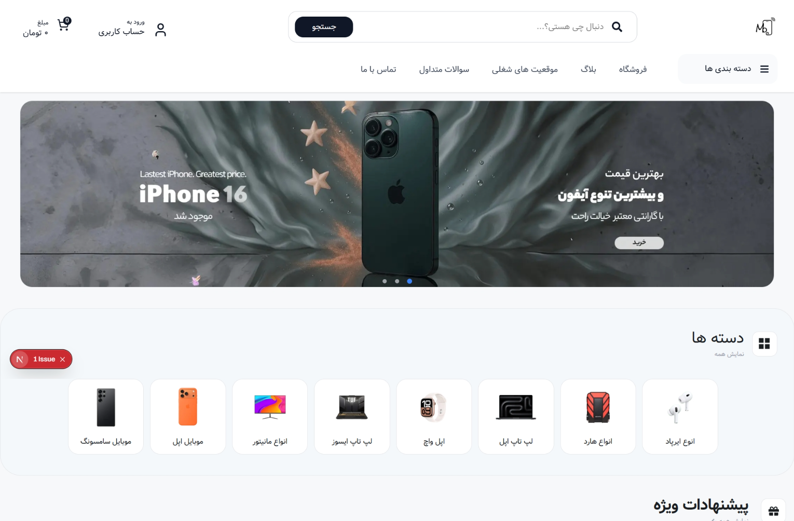
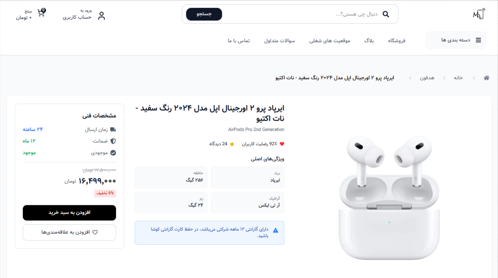
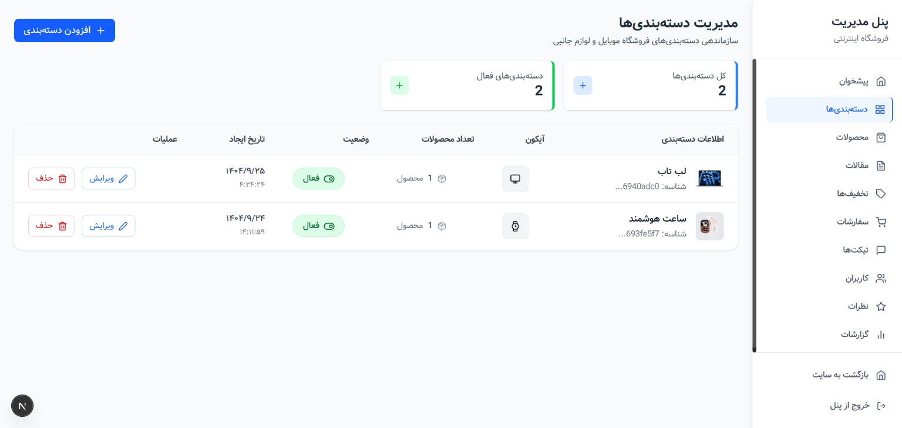

# Mobilisho - فروشگاه موبایل

یک وب‌سایت فروشگاهی موبایل با استفاده از Next.js، API Routes و MongoDB.

## 📸 تصاویر پروژه

### صفحه اصلی

### صفحه محصول

### پنل مدیریت

## 🛠️ فناوری‌های استفاده شده

- **Frontend:** Next.js 14 با TypeScript
- **Backend:** Next.js API Routes
- **Database:** MongoDB با Mongoose
- **Styling:** Tailwind CSS
